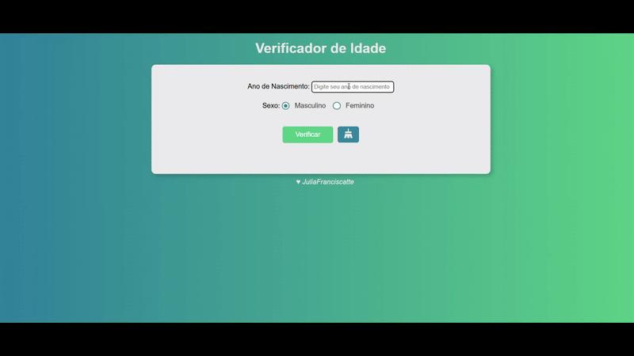

# 🧓 Verificador de Idade

<h3> Você pode acessar o projeto clicando <a href="https://jufranciscatte.github.io/verificador-idade/" target="_blank">aqui</a> </h3>

Este é um projeto feito com **HTML**, **CSS** e **JavaScript** que verifica a idade do usuário com base no ano de nascimento digitado e no sexo selecionado. Após a verificação, uma imagem é exibida de acordo com a faixa etária e o gênero.

<table>
   <tr>
    <td align="center"> </td>
   </tr>
 </table>
  

## 🚀 Funcionalidades

- Entrada de ano de nascimento.
- Seleção de gênero via radio buttons (Masculino ou Feminino).
- Cálculo automático da idade com base no ano atual.
- Exibição de imagem e mensagem correspondente à faixa etária e ao gênero.
- Validação básica dos dados inseridos.
- Botão de limpar: Restaura o estado original da aplicação, limpando os dados inseridos e ocultando o resultado.

## 📸 Demonstração

O projeto exibe imagens diferentes conforme a faixa etária:

- 👶 Criança (0 - 10 anos)
- 🧑 Jovem (11 - 20 anos)
- 🧔 Adulto (21 - 59 anos)
- 👴 Idoso (60+ anos)

As imagens variam de acordo com o gênero escolhido.

## 🛠️ Tecnologias Utilizadas

- **HTML**: Estrutura da página.
- **CSS**: Estilização e responsividade.
- **JavaScript**: Lógica de verificação e manipulação do DOM.

Feito com ♥ by JúliaFranciscatte

Desenvolvido com base em exercício do [Curso em Vídeo](https://cursoemvideo.com) para prática de tecnologias WEB.
